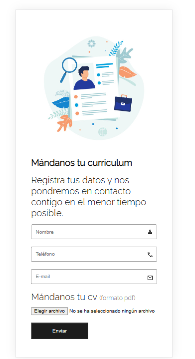
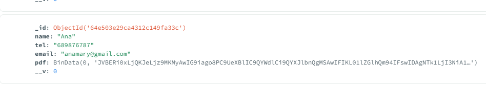
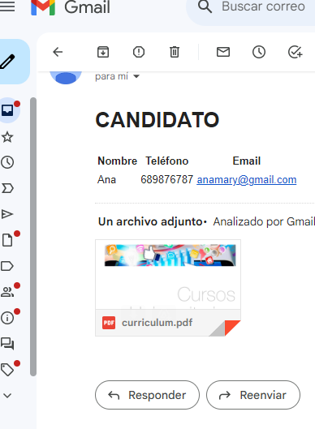

# PROJECT FORM TO SEND CANDIDATES CURRICULUM

## Technologies:
Angular, html, scss, css, Node.js, Node.js express, MongoDB Atlas

### Libraries 
Node.js Express
Nodemon, nodemailer, express, multer, dotenv, mongoose

## Description
Form in which the candidate can send his data: name, telephone, email and curriculum (in pdf format). The data is sent to a mongoDB database and an email is automatically sent with the data of the new candidate to an email.

## Responsive design
Mobile First 

## My work

## The candidate data is saved in mongoDB and sent by email

